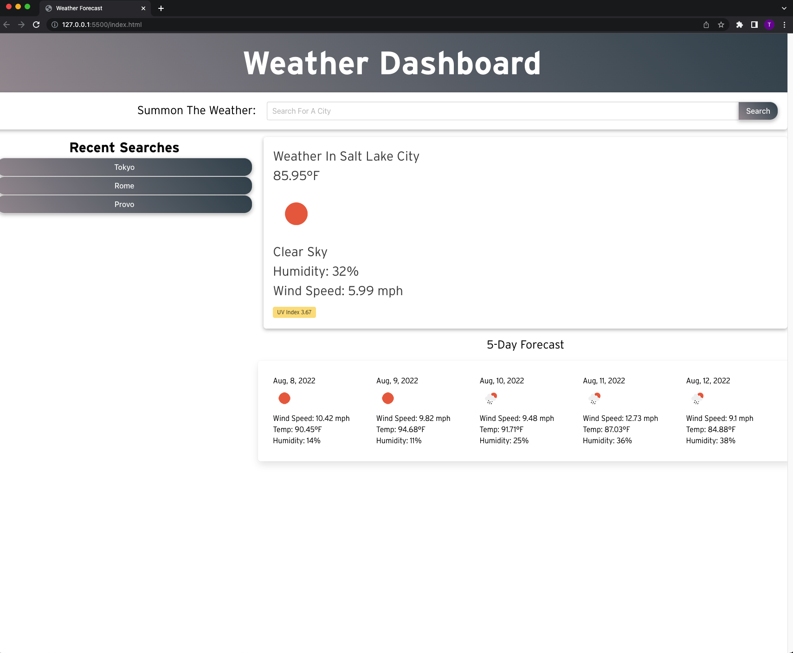

# Description

## Weather App

This weather app allows a user to enter a city and receive the current weather and the 5 day forecast.
- Recently searched cities are saved.
- It will provide a UV Index number and give you a visual color to represent the quality.
- Icons are provided to give you a glance of what the weather may be like.
# Screenshot

# Links
[Deployed Link](https://tommyalv.github.io/Challenge6-WeatherApp/)